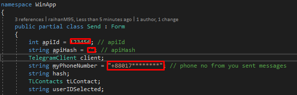
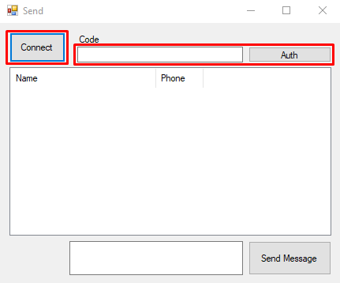

# Telegram-WinApp

   
  
  
  
  

## Getting Started

### Telegram API
Go to
[Creating your Telegram Application](https://core.telegram.org/api/obtaining_api_id). Follow these steps to create `api_id` & `api_hash` and added on [Telegram-WinApp](https://github.com/raihanM95/Telegram-WinApp/blob/main/Send.cs) code.

Your Application is Ready! Now Run your Application and Click Connect button then put OTP for Auth. 

## Technologies

- Windows Form Application 
- C#

## Prerequisites

- Visual Studio 2019 Community and above
- Basic Understanding Windows Form Application

## About the Author

### Raihan Mahmud

- Facebook Page - [Raihan Mahmud RAM](https://www.facebook.com/raihanmahmudofficial)
- Facebook - [Raihan Mahmud RAM](https://www.facebook.com/raihanM95)
- Twitter - [Raihan Mahmud RAM](https://twitter.com/raihanM95)
- Linkedin - [Raihan Mahmud RAM](https://www.linkedin.com/in/raihanM95)

## Licensing

raihanM95/Telegram-WinApp Project is licensed with the [MIT License](https://github.com/raihanM95/Telegram-WinApp/blob/main/LICENSE).
